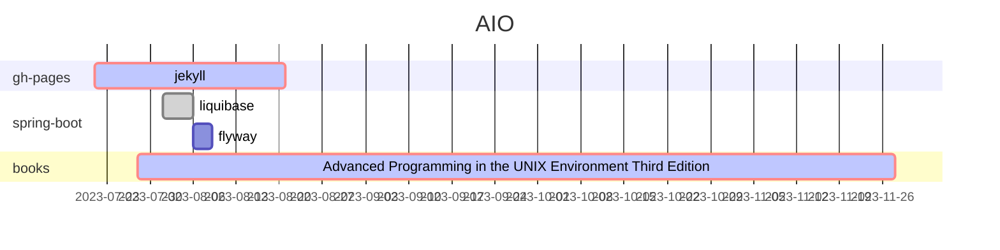

### :octocat: 希君生羽翼 一化北溟鱼

<!--
        The Sockets Networking API Third Edition:  crit, socket, after apue, 4M
        Interprocess Communications Second Edition:  crit, process, after socket, 4M
**bougainvilleas/bougainvilleas** is a ✨ _special_ ✨ repository because its `README.md` (this file) appears on your GitHub profile.

Here are some ideas to get you started:

- 🔭 I’m currently working on ...
- 🌱 I’m currently learning ...
- 👯 I’m looking to collaborate on ...
- 🤔 I’m looking for help with ...
- 💬 Ask me about ...
- 📫 How to reach me: ...
- 😄 Pronouns: ...
- ⚡ Fun fact: ...
-->
