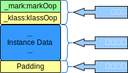
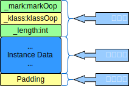

+++
title = 'JVM'
date = '2024-07-05'
author = 'aiclr'
categories = ['develop']
tags = ['jvm','java']
Summary='The Java® Virtual Machine'
+++

## 备注

- 内存
    - 是非常重要的系统资源，是硬盘和cpu的中间仓库及桥梁，承载着操作系统和应用程序的实时运行。
    - JVM内存布局规定了java在运行过程中内存申请、分配、管理的策略，保证了JVM的高效稳定运行。
    - 不同的JVM对于内存的划分方式和管理机制存在着部分差异。
- JVM 定义了若干种程序运行期间会使用到的`run-time data areas`
    - 生命周期与JVM一致的内存区域
        - `heap area`
        - `non-heap`
           - `method area`jdk8采用`metaspace`<sub>元空间</sub>作为`method area`的落地实现
           - **代码缓存**<sub>`JIT`编译产物</sub>
    - 线程私有区域
        - [program counter registers](pcregister)
        - [jvm stacks](jvmstacks)
        - [native stacks](nativemethodstacks)

Every Java application has a single instance of class `Runtime` that allows the application to interface with the environment in which the application is running. The current runtime can be obtained<sub>获得</sub> from the `getRuntime` method.<sub>每个JVM只有一个`Runtime`实例。即为**运行时环境**</sub>
```java
public class Runtime extends Object
```

## 线程

线程是一个程序里的运行单元。JVM允许一个应用有多个线程并发的执行。`Hotspot JVM`里，每个线程都与操作系统的本地线程直接映射。
- 当一个`java线程`准备好执行以后，一个`操作系统的本地线程`也同时创建，`java线程`执行终止后`本地线程`也会回收
- `操作系统`负责所有线程的安排调度到任何一个可用的`cpu`上，一旦`本地线程`初始化成功，会调用`java线程`中的`run()`方法

线程出现异常
- 捕获处理异常也相当于java线程正常终止
- 未捕获处理异常，java线程肯定终止，此时操作系统还要判断一下是否要终止 ***JVM***
    - `deamon`<sub>守护线程</sub>，如果`JVM`中只剩`demon`则`JVM`可以退出
    - 非守护线程 当前线程为最后一个非守护线程则终止`JVM`

### 后台系统线程

`hotspot JVM`的后台系统线程，使用`jconsole`或者其他调试工具，能看到后台有许多线程在运行，不包括`main`方法的`main`线程以及所有这个`main`线程自己创建的线程

- **虚拟机线程**
    - 这种线程的操作是需要`JVM`达到**安全点**才会出现。
    - 这些操作必须在不同线程中发生的原因是他们都需要`JVM`达到**安全点**，这样`heap area`才不会变化。
    - 这种线程的执行类型包括`STW`<sub>stop-the-world</sub>的**垃圾收集**、**线程栈收集**、**线程挂起**、**偏向锁撤销**。
- **周期任务线程**：这种线程是时间周期事件的体现<sub>比如中断</sub>，他们一般用于周期性操作的调度执行
- **GC线程**：这种线程对在`JVM`里不同种类的垃圾收集行为提供了支持
- **编译线程**：这种线程在运行时会将**字节码**编译成**本地代码**
- **信号调度线程**：这种线程**接收信号**并发送给`JVM`,在它内部通过调用适当的方法进行处理


## JVM Options

注意：`-server` 启动 `server模式`，`64位`系统默认是Server模式，在server模式下才可以启用**逃逸分析**
```text
mi :: ~ » java -version
openjdk version "17.0.7" 2023-04-18
OpenJDK Runtime Environment (build 17.0.7+7)
OpenJDK 64-Bit Server VM (build 17.0.7+7, mixed mode)

mi :: ~ » java -version
openjdk version "1.8.0_372"
OpenJDK Runtime Environment (build 1.8.0_372-b07)
OpenJDK 64-Bit Server VM (build 25.372-b07, mixed mode) 
```


- `-XX:+PrintFlagsInitial`：查看所有参数的默认初始值
- `-XX:+PrintFlagsFinal`：查看所有参数的最终值<sub>修改后的值</sub> 
- `-Xms10M`或者`-XX:InitialHeapSize=10M` 设置初始 `heap size`，只影响**新生区**和**养老区**， 默认大小为物理机内存大小除以64。
- `-Xmx10M`或者`-XX:MaxHeapSize=10M` 设置最大 `heap size`，只影响**新生区**和**养老区** 默认大小为物理机内存大小除以4。
    - 通常将`-Xms`和`-Xmx`设置为相同的值,目的是为了能够在Java垃圾回收机制清理完**堆区**后不需要重新分割计算堆区的大小从而提高性能
- 设置`Young区`和`Old区`的比例
    - `-XX:NewRatio=2` '默认2，表示`Young`占1份，`Old`占2份'
    - `-XX:NewRatio=4` '表示`Young占`1份，`Old`占4份'
- `-Xmn100M` 设置 `Young区` 的大小<sub>**一般不使用**</sub>。当与`-XX:NewRatio=2`一起配置冲突时，以`-Xmn`设置的值来分配Young区大小，剩余的区域分给Old区
- `-XX:SurvivorRatio=8` 设置`Young区`下的`Eden区`、`survivor0`区、`survivor1`区的比例
    - 默认值`8：1：1`。由于**自适应的内存分配策略**，查看时可能是`6：1：1`，显式地设置为`8`查看时才是`8：1：1`。
- 开启 or 关闭**自适应的内存分配策略**
    - 开启 `-XX:+UseAdaptiveSizePolicy`
    - 关闭 `-XX:-UseAdaptiveSizePolicy`
- `-XX:MaxTenuringThreshold=15` 设置`Promotion`<sub>晋升Old区阈值</sub>。默认值`15`。
- 开启 or 关闭 [TLAB](tlab)<sub>`Thread Local Allocation Buffer`</sub>。
    - `-XX:+UseTLAB` 默认开启
    - `-XX:-UseTLAB` 关闭'
- `-XX:TLABSize=512k` 设置`TLAB`空间大小。`If this option is set to 0, then the JVM chooses the initial size automatically.`
- `-XX:+PrintGCDetails` 输出详细的GC处理日志
- `-XX:+PrintGC` 输出GC简要信息
- **逃逸分析**<sub>JDK6_23后默认开启</sub>
    - `-XX:+DoEscapeAnalysis` 默认开启逃逸分析
    - `-XX:-DoEscapeAnalysis` 关闭逃逸分析
    - `-XX:+PrintEscapeAnalysis` 查看逃逸分析的筛选结果
- 开启 or 关闭 **标量替换**
    - `-XX:+EliminateAllocations` 默认开启标量替换
    - `-XX:-EliminateAllocations` 关闭标量替换
- `Method area size` 方法区 
    - `-XX:PermSize=20.75M` **JDK7**及以前设置 `PermanentGenerationSpace` **初始值** 默认20.75M
    - `-XX:MaxPermSize=82M` **JDK7**及以前设置 `PermanentGenerationSpace` **最大可分配空间**。32位机器默认是64M，64位机器默认是82M
    - `-XX:MetaspaceSize=21M` **JDK8**及以后，设置**元空间初始值**，平台不同默认值不同，windows下默认约为21M\
    - `-XX:MaxMetaspaceSize=-1` **JDK8**及以后，设置**元空间最大可分配空间**，`-1`表示**没有限制**
- `-XX:HandlePromotionFailure=true` *设置空间分配担保*<sub>`JDK6_24`后过时</sub>

## Native Method Stacks

[Oracle 官方文档](https://docs.oracle.com/javase/specs/jvms/se8/html/jvms-2.html#jvms-2.5.6) \
&nbsp;&nbsp;An implementation of the Java Virtual Machine may use conventional<sub>传统的</sub> stacks, colloquially<sub>通俗地</sub> called "`C stacks`," to support native methods<sub>methods written in a language other than the Java programming language</sub>.Native method stacks may also be used by the implementation of an interpreter<sub>解释程序</sub> for the Java Virtual Machine's instruction<sub>(计算机的)指令</sub> set in a language such as C. Java Virtual Machine implementations that cannot load native methods and that do not themselves rely on<sub>依靠</sub> conventional<sub>传统的</sub> stacks need not supply native method stacks.If supplied, native method stacks are typically<sub>通常</sub> allocated<sub>分配…(给)</sub> per thread when each thread is created.

&nbsp;&nbsp;This specification<sub>规范</sub> permits native method stacks either to be of a fixed<sub>固定的</sub> size or to dynamically *expand and contract*<sub>伸缩</sub> as required by the computation<sub>计算</sub>.If the native method stacks are of a fixed size, the size of each native method stack may be chosen<sub>选择</sub> independently<sub>独立地</sub> when that stack is created.

&nbsp;&nbsp;*A Java Virtual Machine implementation may provide the programmer or the user control over<sub>支配</sub> the initial size of the native method stacks,as well as, in the case of varying-size<sub>大小不一</sub> native method stacks, control over<sub>支配</sub> the maximum and minimum method stack sizes.*

&nbsp;&nbsp;The following exceptional conditions<sub>情况</sub> are associated with<sub>与…有关</sub> native method stacks: If the computation in a thread requires a larger native method stack than is permitted, the Java Virtual Machine throws a `StackOverflowError`. If native method stacks can be dynamically expanded and native method stack expansion is attempted but insufficient<sub>不足的</sub> memory can be made available, or if insufficient<sub>不足的</sub> memory can be made available to create the initial native method stack for a new thread, the Java Virtual Machine throws an `OutOfMemoryError`.

《深入理解Java虚拟机》 \
&nbsp;&nbsp;`Native Method Stacks` 与`JVM Stacks` 所发挥的作用是非常相似的，其区别只是`JVM Stacks`为`jvm`执行`Java`方法<sub>也就是字节码 </sub>服务，而`Native Method Stacks`是为`jvm`使用到的`Native Method`服务。JVM规范对`Native Method Stacks`中方法使用的**语言**、**使用方式**、**数据结构**并没有任何强制规定，因此具体的`jvm`可以根据需要自由实现它，甚至有的`JVM`<sub>HotSpot</sub>直接把`Native Method Stacks`与`JVM Stacks`合二为一。与`JVM`一样，`Native Method Stacks`也会在stack深度溢出时抛出`StackOverflowError`或者stack扩展失败时抛出`OutOfMemoryError`

`Native Method Stacks`特点
- 管理`Native Method`的调用
- 线程私有
- 容量允许被实现成固定大小或可动态扩展
- `Native Method Interface`<sub>`JNI`,本地方法接口</sub>
- `Native Method Library` <sub>本地方法库</sub>

### Native Method

A native method is a java method whose implementation is provided by non-java code

概述
- `Native Method`是java调用非java代码实现的接口.该方法的实现由非java语言实现<sub>例如c或c++</sub>。
- 这个特征非java所特有，很多编程语言都有这一机制<sub>例如：`c++`中可以使用`extern "C"` 告知`c++编译器`去调用一个`c函数`</sub>
- 在定义一个`native method`时，并不提供具体实现<sub>有些像定义一个`java interface`</sub>， 其具体实现是由非java语言在jvm外部实现
- `Native Method Interface`的作用是融合不同的编程语言为Java所用，初衷是融合c/c++程序

#### 本地方法使用c语言实现时

- 具体做法是`native method stacks`中登记`native方法`
- 在`Execution engine`执行时加载`native method library`
- 当某个线程调用一个`native method`时他就进入了一个全新的并且不再受`JVM`限制的世界，它和虚拟机拥有同样的权限
    - `native method`可以通过`native method interface`来访问JVM内部的`runtime data area`
    - 它甚至可以直接使用本地处理器中的寄存器
    - 直接从本地内存的堆中分配任意数量的内存

注意：

**使用`native`标识符修饰，不能与`abstract`修饰符连用**
- `java.lang.Object`
    - `public native int hashCode();`
    - `public final native void notify();`
    - `public final native void notifyAll();`
- `java.lang.Thread`
    - `private native void start0();`
    - `private native void setPriority0(int newPriority);`
    - `private native void stop0(Object o);`
    - `private native void suspend0();`
    - `private native void resume0();`
    - `private native void interrupt0();`
    - `private native void setNativeName(String name);`

使用原因
- 主要原因是java应用需要与java外面的环境交互。
    - 有些层次的任务使用java实现起来不容易，或者对程序的效率有影响
    - 当java需要与一些**底层系统**，如操作系统或某些**硬件**交换信息时的情况，`native method`正是这样一种交流机制
    - 通过`native method`提供一个非常简洁的接口<sub>`JNI`</sub>，无需去了解java应用之外的繁琐的细节
- 与操作系统交互
    - JVM支持java语言本身和运行时库，它是java程序赖以生存的平台，由一个**解释器**<sub>解释字节码</sub>和一些连接到本地代码的库组成
    - **JVM不是一个完整的系统**，经常依赖于一些底层系统的支持。这些底层系统常常是强大的操作系统
    - 通过使用`native method`得以用java实现了jre与底层系统的交互，甚至 JVM 的一些部分都是 C 写的
    - 如果使用一些java语言本身没有提供封装的操作系统的特性时，我们也需要使用`native method`
- `sun's java`
    - Sun的解释器是用`C`实现的，这使得它能像一些普通的C一样与外部交互，jre大部分是Java实现的，也有通过一些`native method`与外界交互
    - 例如`java.lang.Thread`的`setPriority()`方法是由`java`实现的，
        - 但是`setPriority()`的实现调用的是`java.lang.Thread`的`native method setPriority0()`
        - `setPriority0()`方法是由`C`实现的，并被植入JVM内部
        - 在`Windows95`的平台上，这个本地方法最终将调用`Win32 setPriority() API`
    - 这是一个`native method`的具体实现由`JVM`直接提供的例子，更多的情况是`native method`由`external dynamic link library`<sub>外部的动态链接库</sub>提供，然后被JVM调用
- 现状
    - 与硬件有关的应用。
        - 停车场管理系统通过JNI与硬件设备交互。
        - 通过java程序驱动打印机
        - Java系统管理生产设备
    - 在企业级应用中比较少见因为现在的异构领域间通信很发达，比如可以使用socket通信，也可以使用Web Service等

---

## java 对象实例化

### 创建对象的方式

- new
    - 最常见的 new
    - 单例模式构造器访问权限被设置为私有，通过调用静态方法创建对象
    - XxxBuilder/XxxFactory 工厂模式的静态方法创建对象
- newInstance()
    - Class的newInstance()
    - jdk9被标记为过时，反射方式，比较苛刻，只能调用空参构造器，且构造器访问权限必须设置为public
- newInstance(args)
    - Constructor的newInstance(args)
    - 替代Class的newInstance()，反射方式，可以调用无参、有参构造器，且对构造器访问权限没有要求
- clone()
    - 不调用构造器，当前类需要实现Cloneable接口，实现clone()
- 反序列化
    - 从文件或网络中获取一个对象的二进制流，将二进制流转换为对象
- 第三方库 Objenesis

### 创建对象的步骤

- 判断对象对应的类是否Loader<sub>加载</sub>、Linking<sub>链接</sub>、Initialization<sub>初始化</sub>
    - JVM遇到一条new指令，首先去检查这个指令的参数能否在Metaspace的常量池中定位到一个类的符号引用，
    - 检查这个符号引用代表的类的元信息是否存在<sub>即该类是否已经加载、解析、初始化</sub>
        - 如果不存在，在双亲委派模式下，使用当前类加载器以ClassLoader+包名+类名为Key进行查找对应的.class文件。
            - 如果没有找到文件，则抛出ClassNotFoundException
            - 如果找到文件，则进行类加载，并生成对应的Class类对象
        - 如果存在，则继续后续步骤
- 为对象分配内存
    - 如果内存规整
        - 指针碰撞
    - 如果内存不规整
        - 虚拟机需要维护一个列表
        - 空闲列表分配
- 处理并发安全问题
    - 采用 CAS<sub>compare and swap</sub>配上失败重试保证更新的原子性 atomic
    - 每个线程预先分配一块**线程私有的分配缓冲区**<sub>TLAB.Thread Local Allocation Buffer</sub>
- 初始化分配到的空间
    - 所有属性设置默认值，保证对象实例字段在不赋值时可以直接使用
- 设置对象的对象头
- 执行<init>方法进行初始化

### 计算实体对象占用内存

实例对象内存计算 
</br>

</br>
数组对象内存计算 
</br>


- Head<sub>对象头</sub>
    - _mark: MarkWord存储对象自身运行时数据
        - 32位系统 占用4byte
        - 64位系统 占用8byte
    - _klass: klass指针，指向该类元数据的指针，jvm通过这个指针确定这个对象是哪个类的实例
        - 32位系统 占用4byte
        - 64位系统
            - 不开启指针压缩 占用8byte
            - 开启指针压缩 占用4byte
    - _length: 数组对象才有，用来记录数组长度。占用4byte
- Instance Data<sub>实例数据</sub>
    - 对象真正存储的有效信息，各类型字段内容，父类继承和自己定义的
    - 继承关系
        - 先存放父类中的成员，接着才是子类中的成员，父类要按照8byte规定对齐
        - 例如枚举（相当于继承） 有一个String，具体枚举大小=8+4+（4+4）+4=24
        - markWord=8，klass=4，父类有一个String=4，父类对齐+4=（4+4）=8，此时大小为20，对齐+4=24
- Padding<sub>对齐填充</sub>
    - HotSpot VM的自动内存管理系统要求对象起始地址必须是8字节的整数倍，最终字节大小要能被8整除。不能被整除时使用 padding 补位到能被8整除的长度。
    - 访问未对齐的内存，处理器需要作两次内存访问
    - 访问已对齐的内存，处理器仅需要一次内存访问

### 附录

|    类型     | 字节数(Byte) | 位数(bit) |                               取值范围                                |
|:---------:|:---------:|:-------:|:-----------------------------------------------------------------:|
|   byte    |     1     |    8    |                           -2^7 ~ 2^7-1                            |
|   short   |     2     |   16    |                          -2^15 ~ 2^15-1                           |
|    int    |     4     |   32    |                          -2^31 ~ 2^31-1                           |
|   long    |     8     |   64    |                          -2^63 ~ 2^63-1                           |
|  boolean  |     1     |    8    |                            true和false                             |
|   char    |     2     |   16    |           unicode编码，前128字节与ASCII兼容字符存储范围在 \u0000~\uFFFF           |
|   float   |     4     |   32    | 3.402823e+38 ~ 1.401298e-45（e+38表示是乘以10的38次方，同样，e-45表示乘以10的负45次方） |
|  double   |     8     |   64    |                   1.797693e+308~ 4.9000000e-324                   |
| reference |    4/8    |  32/64  |         引用型数据，32位系统或开启指针压缩的64位系统占用4byte，64位系统不开指针压缩占8byte         |

</br>

| 对象头           | _mark                | _klass                            | _length         |
|:--------------|:---------------------|:----------------------------------|:----------------|
| 描述            | MarkWord 存储对象自身运行时数据 | 指向该类元数据的指针，jvm通过这个指针确定这个对象是哪个类的实例 | 数组对象才有，用来记录数组长度 |
| 32位系统         | 4byte                | 4byte                             | 4byte           |
| 64位系统 开启指针压缩  | 8byte                | 4byte                             | 4byte           |
| 64位系统 不开启指针压缩 | 8byte                | 8byte                             | 4byte           |
