+++
title = 'JVM heap'
date = '2024-07-06'
author = 'aiclr'
categories = ['develop']
tags = ['jvm','java','heap']
Summary='jvm heap area'
+++

- [Garbage Collection 参考](../gc)
- [内存分析工具参考](../../tools/jvmtools/)
- [Oracle 官网文档](https://docs.oracle.com/javase/specs/jvms/se8/html/jvms-2.html#jvms-2.5.3)

&nbsp;&nbsp;The Java Virtual Machine has a heap that is shared among all Java Virtual Machine threads. The heap is the `run-time data area` from which memory for `all class instances` and `arrays` is allocated分配.

&nbsp;&nbsp;The heap is created on virtual machine start-up. Heap storage存储 for objects is reclaimed回收的 by an automatic storage management system (known as a `garbage collector`); objects are never explicitly显示地 deallocated取消分配. The Java Virtual Machine assumes假定 no particular特别的 type of automatic storage management system, and the storage management technique技术 may be chosen according相应的 to the implementor's实现者 system requirements系统需求. The heap may be of a fixed固定的 size or may be expanded扩展 as required by the computation计算 and may be contracted收缩 if a larger heap becomes unnecessary. The memory for the heap does not need to be contiguous连续的.

&nbsp;&nbsp;*A Java Virtual Machine implementation may provide the programmer or the user control over the initial size of the heap, as well as, if the heap can be dynamically expanded or contracted, control over the maximum and minimum heap size.*

&nbsp;&nbsp;The following exceptional异常的 condition情况 is associated相关的 with the heap:
- If a computation requires more heap than can be made available by the automatic storage management system, the Java Virtual Machine throws an `OutOfMemoryError`.

## 概述

- 一个`JVM进程`只存在一个`heap area`，是`java`内存管理的**核心区域**
- `heap area`在JVM启动时即被创建，其空间大小也随即确定`heap area size`是可以调节的，是JVM管理的最大一块内存空间
- `jvm规范`规定`heap area`可以处于物理上**不连续**的内存空间中，但在**逻辑上**它应该被视为**连续的**
- 所有线程共享 `heap area`. 在这里还可以划分线程私有的**缓冲区**[TLAB](tlab)Thread local allocation buffer
- **数组**和**对象实例**可能永远不会存储在`jvm stack`上，因为`stack frame`中保存**指向对象或者数组在堆中的位置的引用**
- 在方法结束后，`heap area`中对象实例不会马上被移除，仅仅在垃圾收集的时候才会被移除
- `heap area` 是`Garbage Collection`执行垃圾回收的重点区域

## 总结

- `YoungGenerationSpace`是对象**诞生、成长、消亡**的区域，一个对象在这里产生、应用，最后被垃圾回收器收集、结束生命
- `TenureGenerationSpace`放置**长生命周期**的对象，通常都是从`Survivor区`筛选拷贝过来的Java实例对象
  - 特殊情况
    - 普通的对象优先尝试分配在[TLAB](tlab)Thread local allocation buffer上
    - 对象较大`JVM`试图直接分配在`Eden`区
    - 对象太大无法在`Yong区`找到足够长的**连续空闲**空间，`JVM`直接分配到`Old区`
- `MinorGC`只发生在`Young区`，发生频率比`MajorGC`高很多，效率也比`MajorGC`高`10`倍以上
- 当`GC`发生在`Old区`则称为`MajorGC`或`FullGC`

## 分代思想

- 经研究，不同对象的生命周期不同，70%~99%的对象是**临时对象**
    - 新生代: 由`Eden`、`两`块`大小相同`的`Survivor`区`s0区`、`s1区`或`from区`、`to区`.`to区`总是空的构成
    - 老年代: 存放新生代中经历**多次**`GC`仍存活的对象
- 不分代完全可以

分代的唯一理由就是**优化**`GC`性能。如果没有分代，将所有的对象实例都放在一块，`GC`时寻找哪些对象实例没有被使用，此时需要对所有区域进行扫描，`STW`stop the world时间相对分代策略会变长。\
很对对象实例都是**朝生夕死**。\
如果分代，把新创建的对象实例放到某一地方，`GC`时先把这块存储新创建对象实例的区域进行回收，`STW`时间相对不分代的扫描全部区域少很多。

`JVM`中的java实例对象可以被划分为两类
- 生命周期较短的瞬时对象，这类对象创建和消亡都非常迅速
- 生命周期非常长，在某些极端的情况下还能够与`JVM`的生命周期保持一致

现代垃圾收集器大部分都基于分代收集理论设计
- `Young` == 新生区 == 新生代 == 年轻代
- `Old` == 养老区 == 老年区 == 老年代
- `method area` == 永久区 == 永久代

| heap area 逻辑上分为三部分 | `java7`及之前     | `java8`及之后   |
|:---|:---|:---|
| `Young`            | `Yong Generation Space` 新生区 `Young/New` | 同左 |
|                    | `Eden区` | 同左  |
|                    | `Survivor区`只有一个存放数据，当`jvm`计算容量时只会考虑**一个**，所以`Runtime.getRuntime().totalMemory()`和`Runtime.getRuntime().maxMemory()`的值会少一个`survivor区`的大小 | 同左 |
|                    | `Survivor from区` | 同左 |
|                    | `Survivor to区` | 同左 |
| `Old`              | `Tenure Generation Space` 养老区 `Old/Tenure` | 同左 |
| `Method Area`      | `Permanent Space`  永久区 `Perm` | `Meta Space` 元空间 `Meta` |

### 新生代

在`Hotspot`中`Eden`空间和另外两个`Survivor`空间默认占比是`8：1：1` ;通过`-XX:SurvivorRatio=8`调整比例默认为`8`，但是实际比例是`6：1：1` `-XX:+UseAdaptiveSizePolicy`默认开启了**自适应内存分配策略**，显式设置为`8`才会生效 \
**几乎所有**的`Java实例对象`都是在`Eden`区被`new`出来 \
**绝大部分**的`Java实例对象`的销毁都在**新生代**进行 \
`IBM`公司的专门研究表明，**新生代**中`80%`的对象都是朝生夕死

可以使用选项`-Xmn`设置`新生代`最大内存大小。这个参数一般使用默认值就可以了

### 老年代

[todo]

### 对象分配内存过程

- `new`的对象优先尝试放`Eden`区，`Eden`区可能已有对象
- 如果`Eden`区剩余空间放得下，则直接在`Eden`区为对象分配内存
- 如果`Eden`区剩余空间放不下，则触发`Minor GC``YGC`，`YGC`会将`Eden`区和`From`区清空
   - 将`Eden`区和`From`区内的不再被其他对象所引用的对象进行销毁。
   - 将`Eden`区和`From`区内幸存的对象，移动到`To`区，并且**标识移动次数**加`1`次
   - 此时`Eden`区为空，再次判断`Eden`区是否放得下
       - 放得下则放`Eden`区
       - 放不下则尝试放`Old`区一般是超大对象
           - 放得下，直接将对象放置到`Old`区
           - 放不下，则触发`Major GC`，回收一次`Old`区，再进行判断`Old`区是否放的下
               - 放得下则直接将对象放置到`Old`区
               - 放不下则`OOM`
- `Survivor 0`区和`Survivor 1`区
   - 当`JVM进程`第一次触发`YGC`。将`Eden`区内的不再被其他对象所引用的对象进行销毁。
   - 将`Eden`区所有幸存对象，尝试移到`Survivor 0`区会将`Eden`区清空
       - 当`Survivor 0` 区空间放得下则放在`Survivor 0`区，**移动次数**加`1`
       - 幸存对象太大放不下，则直接晋升老年代，放到`Old`区，**移动次数**加`1`
   - 当`Eden`区和`Survivor 0`或`Survivor 1`区有数据时触发`YGC`。此时`JVM`将`Eden`区和`Survivor 0`区此时`Survivor 0`区会称为From区内不再被其他对象所引用的对象进行销毁。此时的`From`区要根据实际情况来定，此处只是用`Survivor 0`区作为例子说明
       - 尝试将幸存的对象移动到`Survivor 1`区此时也叫`To`区。
           - 当`From`区幸存对象阈值等于设置的值
               - 则执行`Promotion`晋升到老年代`Old`区，**移动次数**加`1`
           - 当From区幸存对象阈值小于设置的值
               - `To`区放得下则放到`To`区，**移动次数**加`1`
               - `To`区放不下直接放`Old`区，**移动次数**加`1`此时`Old`区正常设置参数肯定放的下，因为`Young`空间一般都比`Old`空间小
   - 之后就是重复3步

注意：\
当`Eden区`满时才会触发`YGC`，`Survivor 0`或`Survivor 1`区满不会触发`YGC` \
`YGC`回收`Eden区`和`From区``YGC`后会清空`Eden`区和`From`区 \
`Survivor 0`区和`Survivor 1`区大小`1：1`，肯定会有一个为空。为了使用**复制算法**，目的是解决**碎片化**问题 \
`Survivor 0`区和`Survivor 1`区：复制之后有交换，谁空谁时`To`区 \
`Garbage Collection`频繁在`Young`区收集，很少在`Old`区收集，几乎不在`Perm`和`Meta`收集 \
对象可能直接分配在`Old`区 \
`Eden`区和`To`区满了，对象即使没达到阈值`Promotion`，也可能直接晋升到Old区

### 内存分配策略

对象晋升规则`Promotion`：
- 如果对象在`Eden`出生并经过第一次`MinorGC`后仍存活，并且能被`Survivor`容纳，将被移动到`Survivor`空间，并将对象年龄设为`1`
- 对象在`Survivor`区中每熬过一次`MinorGC`年龄就`+1`岁，当它的年龄增加到一定程度时默认`15`岁，每个`JVM`每个`GC`都有所不同，就会晋升`Promotion`到老年代

对象晋升`Promotion`Old的年龄阈值，可以通过`-XX:MaxTenuringThreshold`来设置

针对不同年龄段的对象分配原则：
- 优先分配到`Eden`
- **大对象**需要连续的内存空间，更高概率触发`GC`直接分配到`Old`.尽量避免程序中出现过多的大对象
- 长期存活的对象分配到`Old`经过多次YGC仍存活，达到阈值则晋升到老年代
- 动态对象年龄判断
   - 如果`Survivor`区中相同年龄的所有对象大小的综合大于`Survivor`空间的**一半**，年龄大于或等于该年龄的对象可以直接进入`Old`无须达到`MaxTenuringThreshold`设置的年龄
- [空间分配担保](#空间分配担保)
   - `-XX:HandlePromotionFailure`

### 空间分配担保

在发生`MinorGC`之前，`jvm`会检查`Old`区最大可用的连续空间是否大于`Young`区所有对象的总空间
- 如果大于则此次`MinorGC`是安全的
- 如果小于则`jvm`会查看`-XX:HandlePromotionFailure`设置值是否运行担保失败
   - 如果`-xx:HandlePromotionFailure=true`会继续检查`Old`区最大可用连续空间是否大于历次晋升`Old`区的对象的平均大小
       - 大于，则尝试进行一次`MinorGC`，但这次`MinorGC`是有风险的
       - 小于，则改为进行一次`MajorGC`
   - 如果`-xx:HandlePromotionFailure=false`则改为进行一次`MajorGC`

在`JDK6 Update24`之后，`HandlePromotionFailure`参数不会再影响到`JVM`的空间分配担保策略，虽然`OpenJDK`源码中仍定义了`HandlePromotionFailure`参数，但是在代码中已经不会再使用它. 规则变更为
- `Old`区的连续空间大于`Young`区对象总大小进行`MinorGC`
- `Old`区的连续空间大于历次晋升的平均大小进行`MinorGC`
- 否则进行`MajorGC`

### heap area是分配对象存储位置的唯一选择

随着`JIT`编译器的发展与[逃逸分析](#escape-analysis)Escape Analysis技术逐渐成熟，[栈上分配](#栈上分配)、[标量替换](#标量替换)优化技术将会导致一些微妙变化，所有对象都分配到`heap area`上也渐渐变得不那么绝对

在`JVM`中，对象是在`heap area`中分配内存，但是如果经过[逃逸分析](#escape-analysis)Escape Analysis后发现一个对象并没有逃逸出方法的话，那么就可能被优化成[栈上分配](#栈上分配), 这样无需在`heap area`上分配内存，也不需要`GC`，这也是常见的**堆外存储技术**。\
例如：\
基于`OpenJDK`深度定制的`TaoBaoVM`其中创新的`GCIH`GC invisible看不见的 heap技术实现`off-heap`.\
将**生命周期较长**的实例对象从`heap area`中迁移到`heap area`外，并且`GC`不能管理`GCIH`内部的实例对象，以此达到降低`GC`的**回收频率**和提升`GC`的**回收效率**的目的

#### Escape Analysis

**逃逸分析**技术不成熟历史
- 关于**逃逸分析**的论文在`1999年`就已经发表，但直到`JDK1.6`才有实现，而且这项技术至今也不是十分成熟
- 原因是：无法保证**逃逸分析**的性能一定高于逃逸分析的消耗
   - 虽然经过**逃逸分析**可以做[标量替换](#标量替换)、[栈上分配](#栈上分配)、[锁消除](#锁消除)，但是逃逸分析自身也需要进行一系列复杂的分析，是一个相当耗时的过程。
   - 极端的例子，经过**逃逸分析**后，发现没有一个对象是不逃逸的，那么逃逸分析的过程就白白浪费掉了
- 虽然不成熟，但是他是`JIT`编译器优化技术中一个十分重要的手段
- 有些观点认为，通过**逃逸分析**`JVM`会在`stack area`上分配不会逃逸的对象，这在**理论上**是可行的，但是实际上取决于`JVM`设计者的选择。
   - `Oracle Hotspot JVM`并未这么做，**逃逸分析**的相关官方文档已经说明，所以可以明确所有的对象实例都是创建在`heap area`上
- 目前很多书籍还是基于`JDK7`以前的版本，`JDK`已经发生很大变化，
   - `intern`**字符串缓存**和**静态变量**曾经都被分配在`Permanent Space`永久代上
   - 而`Permanent Space`永久代已经被`Meta Space`元空间取代
   - 但是`intern`**字符串缓存**和**静态变量**并不是转移到`Meta Space`元空间，而是直接在`heap area`上分配，所以这一点同样符合：所有对象实例都是分配在`heap area`

概述
- 使用**逃逸分析**手段将本该分配到`heap area`上的对象分配到`stack`
- 有效减少Java程序中**同步负载**和内存`heap area`分配压力的跨函数全局数据流分析算法
- 通过**逃逸分析**，`hotSpot`编译器能够分析出一个新的对象的引用的使用范围从而决定是否要将这个对象分配到`heap area`上
- **逃逸分析**的基本行为就是分析**对象动态作用域**
   - 当一个对象在方法中被定义后，对象只在方法内部使用，则认为没有发生逃逸
   - 当一个对象在方法中被定义后，它被外部方法所引用，则认为发生逃逸。例如作为调用参数传递到其他地方中。
- 没有发生逃逸的对象，则可以分配到`stack`上，随着方法执行的结束，该对象随`stack frame`一起被移除，不需要`GC`就释放内存
- `JDK6u23`后，`HotSpot`中默认就已经开启了**逃逸分析**
- 如果使用的是较早的版本
   - `-XX:+DoEscapeAnalysis`开启逃逸分析
   - `-XX:+PrintEscapeAnalysis`查看逃逸分析的筛选结果

*结论: 开发中能使用**局部变量**的，就不要在**方法外**定义*

代码优化：
- [栈上分配](#栈上分配)：将`heap area`分配转化为`stack`分配，如果一个对象在子程序中被分配，使指向该对象的指针永远不会逃逸，对象可能是`stack`分配的候选，而不是`heap`分配
- [锁消除](#锁消除)同步省略：如果一个对象被发现只能从一个线程被访问到，那么对于这个对象的操作可以不考虑同步
- [标量替换](#标量替换)：有的对象如果不需要作为一个连续的内存结构保存也可以被访问，那么对象的一部分或全部可以不存储在内存，而是存储在`CPU寄存器`中

#### 栈上分配

- `JIT`编译器在编译期根据[逃逸分析](#escape-analysis)的结果发现如果一个对象并没有逃逸出方法，就**可能**被优化成**栈上分配**
- 分配完成后，继续在该线程的`jvm stack`内执行，最后线程结束，`jvm stack`被回收，**局部变量对象**也被回收，这样就不需要**GC**

#### 锁消除

锁消除同步省略 \
线程同步的代价相当高，同步的后果是降低并发性和性能 \
**动态编译**同步块的时候，`JIT`编译器可以借助[逃逸分析](#escape-analysis)来判断同步块所使用的**锁对象**是否只能够被**一个线程**访问而没有被发布到其他线程 \
如果没有被发布到其他线程，`JIT`编译器在编译这个同步块的时候就会取消这部分代码的同步，从而提高并发性和性能。这个过程就叫**同步省略**，也称为**锁消除**

#### 标量替换

**标量**`Scalar` ：一个无法再分解成更小的数据的数据。Java中的**原始数据类型**就是**标量**`Scalar` \
**聚合量**`Aggregate` ：可以分解的数据。java中的**普通类对象**就是**聚合量**`Aggregate`，因为可以分解成其他**聚合量**`Aggregate`和**标量**`Scalar`

`JIT`编译阶段，如果经过[逃逸分析](#escape-analysis)，一个对象不会被外界访问的话未发生逃逸，就会把这个对象拆解成若干个其中包含的若干个成员变量来代替。这个过程就是**标量替换**
- **标量替换**可以大大减少`heap area`内存的占用，因为一旦不需要创建对象，那么就不再需要分配`heap area`内存
- **标量替换**为[栈上分配](#栈上分配)提供了很好的基础
- `-XX:+EliminateAllocations`开启标量替换默认开启，允许将对象**打散**分配在`jvm stack`上