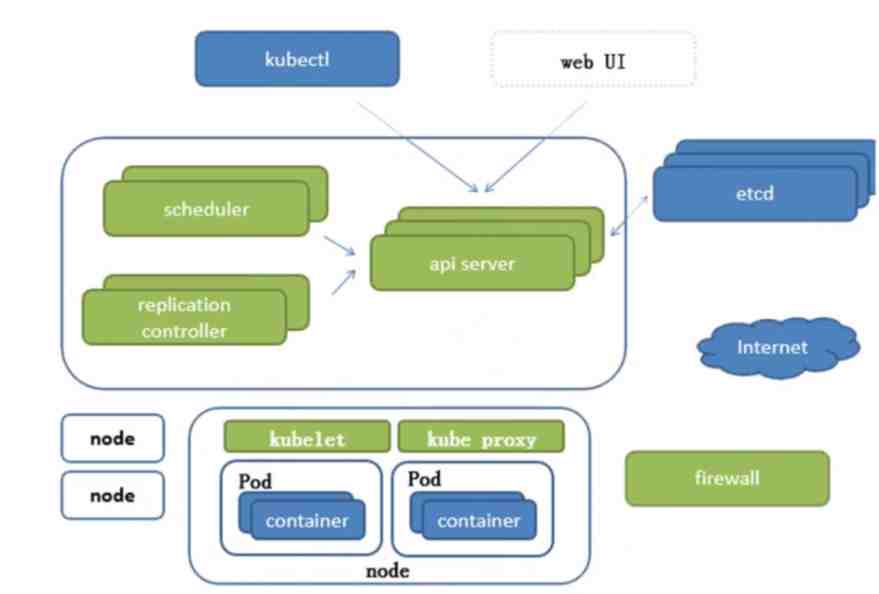
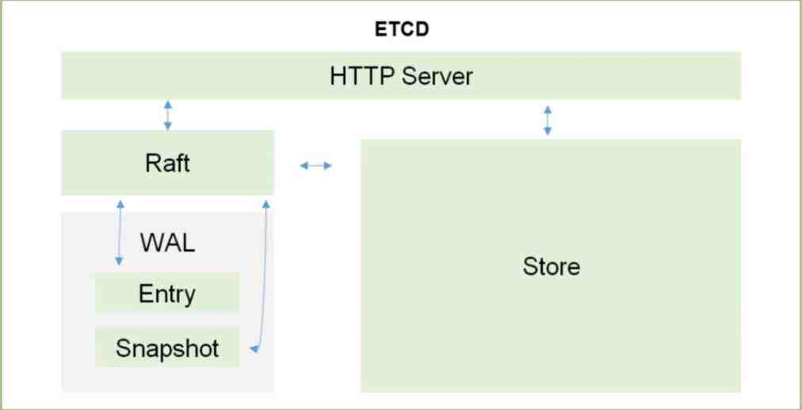

+++
title = 'Kubernetes'
date = '2024-07-07'
draft = true
author = 'aiclr'
categories = ['software']
tags = ['k8s']
Summary='hello world'
+++

go语言，根据 google 10年容器化基础架构 borg 开发



## api Server

- 所有服务访问统一入口

## replication controller

- 维持副本期望数目

## scheduler

- 负责介绍任务，选择合适的节点进行分配任务


## ETCD

etcd 可信赖的分布式键值存储服务，能够为整个分布式集群存储一些关键数据，协助分布式集群的正常运转，存储k8s集群所有重要信息（持久化

- 可信赖：天生支持集群，不需要借助其他组建
- 保存整个集群需要持久化的配置文件、配置信息，主要用于恢复数据
- v2版本，数据存储在内存中，在Kubernetes v1.11弃用
- v3版本，引入本地卷的持久化操作，关机后可以从本地磁盘恢复
- 架构图


## Kubelet

直接跟容器引擎交互实现容器的生命周期管理
- [reference](https://kubernetes.io/docs/reference/kubectl/overview/)

### API Server 监听8001端口

```shell
master:~ # kubectl proxy
Starting to serve on 127.0.0.1:8001

http://localhost:8001
```

#### kubectl 版本

```shell
kubectl version
curl http://localhost:8001/version
```

### [namespace](https://kubernetes.io/docs/concepts/overview/working-with-objects/namespaces/)

> Not All Objects are in a Namespace
> > Most Kubernetes resources (e.g. pods, services, replication controllers, and others) are in some namespaces. However, namespace resources are not themselves in a namespace. And low-level resources, such as nodes and persistentVolumes, are not in any namespace
>
> > flag --namespace

#### example

```shell
master:~ # kubectl get namespace
NAME                   STATUS   AGE
default                Active   6d9h
kube-node-lease        Active   6d9h
kube-public            Active   6d9h
kube-system            Active   6d9h
kubernetes-dashboard   Active   6d6h
master:~ # kubectl run nginx --image=nginx --namespace=<insert-namespace-name-here>
master:~ # kubectl get pods --namespace=<insert-namespace-name-here>
```

### [nodes/no](https://kubernetes.io/docs/concepts/architecture/nodes/)

```shell
kubectl get nodes
kubectl get no
kubectl describe no/master-dell

master-dell:~/yaml/fly # kubectl describe no/master-dell
Name:               master-dell
Roles:              control-plane,master
# 省略 内容
Taints:             node-role.kubernetes.io/master:NoSchedule
# 省略 内容
```

#### taints node 调度策略 `kubectl taint nodes master-dell node-role.kubernetes.io/master=:PreferNoSchedule`

> taints node 调度策略
> >不能被调度，当只有一个 master 时要将 master 设置为可调度
> > >Taints:             node-role.kubernetes.io/master:NoSchedule 
> 
> >不仅不会调度，还会驱逐Node上的Pod
> > >Taints:             node-role.kubernetes.io/master:NoExecute 
> 
> >尽量不要调度到此Node
> > >Taints:             node-role.kubernetes.io/master:PreferNoSchedule

### deployments/deploy

```shell
kubectl get deployments
kubectl get deploy
kubectl describe deployment
kubectl create deployment rabbitmq --image=rabbitmq:3.9-management-alpine
kubectl get po/rabbitmq-66b64b6c68-tnnc2 deploy/rabbitmq
kubectl delete deploy rabbitmq
```

### pods/po

```shell
kubectl get po
kubectl get pods
kubectl get pods -l app=rabbitmq
kubectl get pods -l version=v1
kubectl get pods -o wide
kubectl get pods -o json

kubectl describe pods
kubectl describe pods rabbitmq-66b64b6c68-lwbfn
kubectl describe pods -l app=rabbitmq
curl http://localhost:8001/api/v1/namespaces/default/pods/rabbitmq-66b64b6c68-lwbfn

kubectl logs rabbitmq-66b64b6c68-lwbfn
kubectl logs -l app=rabbitmq

kubectl exec -ti rabbitmq-66b64b6c68-lwbfn -- bash
```

### services/svc

```shell
kubectl get svc
kubectl get services -l app=rabbitmq

kubectl expose deployment/rabbitmq --type="NodePort" --port 15672

kubectl describe services/rabbitmq

kubectl delete services -l app=rabbitmq
kubectl delete service rabbitmq-66b64b6c68-lwbfn
```

### label

```shell
kubectl label pods rabbitmq-66b64b6c68-lwbfn version=v1
kubectl get pods -l version=v1
```

### scale

```shell
kubectl scale deployments/kubernetes-bootcamp --replicas=4
kubectl get pods -o wide
```

### update

```shell
kubectl set image deployments rabbitmq rabbitmq=rabbitmq:3.8.26-management-alpine
kubectl rollout status deployments rabbitmq
kubectl rollout undo deploy rabbitmq
```


## Kube proxy

- 负责写入规则至IPTABLES、IPVS实现服务映射访问

## CoreDNS

- 可以为集群中的SVC创建一个域名IP的对应关系解析

## Dashboard

- 给K8s集群提供一个B/S架构访问体系


### 外部访问

- 下载 recommended.yaml `https://raw.githubusercontent.com/kubernetes/dashboard/v2.4.0/aio/deploy/recommended.yaml`
- 改造 [recommended.yaml](conf/recommended.yaml) to  [dashboard.yaml](conf/dashboard.yaml)文件
- 部署 `kubectl apply -f dashboard.yaml`
- https 访问 `https://192.168.1.100:30003`
- 获取 ServiceAccount kubernetes-dashboard token 登录
    1. 查看所有 secrets `kubectl get secrets -n kubernetes-dashboard`
    2. 查看 secrets token `kubectl describe secrets/kubernetes-dashboard-token-f6pcf -n kubernetes-dashboard`

#### 改动 service 使用 NodePort 直接暴露服务

```yaml
kind: Service
apiVersion: v1
metadata:
  labels:
    k8s-app: kubernetes-dashboard
  name: kubernetes-dashboard
  namespace: kubernetes-dashboard
spec:
  type: NodePort # 暴露 服务
  ports:
    - port: 443
      targetPort: 8443
      nodePort: 30003
  selector:
    k8s-app: kubernetes-dashboard
```

#### 改动 ServiceAccount 权限为 cluster-admin

```yaml
apiVersion: rbac.authorization.k8s.io/v1
kind: ClusterRoleBinding
metadata:
  name: kubernetes-dashboard
roleRef:
  apiGroup: rbac.authorization.k8s.io
  kind: ClusterRole
  name: cluster-admin # 管理员才有权限 查看 资源 与 服务
subjects:
  - kind: ServiceAccount
    name: kubernetes-dashboard
    namespace: kubernetes-dashboard
```

### localhost

- [Dashboard UI](https://kubernetes.io/docs/tasks/access-application-cluster/web-ui-dashboard/)
- [https://kubernetes.io/docs/tasks/access-application-cluster/web-ui-dashboard/](https://kubernetes.io/docs/tasks/access-application-cluster/web-ui-dashboard/)
- [https://github.com/kubernetes/dashboard/blob/master/docs/user/accessing-dashboard/README.md](https://github.com/kubernetes/dashboard/blob/master/docs/user/accessing-dashboard/README.md)

```shell
kubectl apply -f https://raw.githubusercontent.com/kubernetes/dashboard/v2.4.0/aio/deploy/recommended.yaml

slave:~ # kubectl get namespaces
NAME                   STATUS   AGE
default                Active   3h36m
kube-node-lease        Active   3h36m
kube-public            Active   3h36m
kube-system            Active   3h36m
kubernetes-dashboard   Active   36m
slave:~ # kubectl get pods -n kubernetes-dashboard
NAME                                        READY   STATUS    RESTARTS   AGE
dashboard-metrics-scraper-c45b7869d-vrc6t   1/1     Running   0          43m
kubernetes-dashboard-576cb95f94-87lz5       1/1     Running   0          43m
slave:~ # kubectl get svc -n kubernetes-dashboard
NAME                        TYPE        CLUSTER-IP       EXTERNAL-IP   PORT(S)    AGE
dashboard-metrics-scraper   ClusterIP   10.100.244.14    <none>        8000/TCP   43m
kubernetes-dashboard        ClusterIP   10.107.123.253   <none>        443/TCP    43m
```

- 在新 terminal 开启代理 `kubectl proxy`之后保持窗口
- 在本机浏览器访问 `http://localhost:8001/api/v1/namespaces/kubernetes-dashboard/services/https:kubernetes-dashboard:/proxy/`
- 获取 ServiceAccount kubernetes-dashboard token 登录
    1. 查看所有 secrets `kubectl get secrets -n kubernetes-dashboard`
    2. 查看 secrets token `kubectl describe secrets/kubernetes-dashboard-token-f6pcf -n kubernetes-dashboard`
    3. 此时的用户 非 cluster-admin 无权限查看资源 参考上面 改动 ServiceAccount 权限为 cluster-admin

#### 删除

```shell
kubectl delete -f dashboard.yaml
```

#### deployment、pods、services

```shell
kubectl get deploy -n kubernetes-dashboard
kubectl delete deploy/kubernetes-dashboard -n kubernetes-dashboard

kubectl get po -n kubernetes-dashboard
kubectl delete po/kubernetes-dashboard -n kubernetes-dashboard

kubectl get svc -n kubernetes-dashboard
kubectl delete svc/kubernetes-dashboard -n kubernetes-dashboard
```

### cluster role、ServiceAccount、ClusterRoleBinding、RoleBinding

```shell
kubectl get clusterrole -n kubernetes-dashboard
kubectl delete clusterrole/kubernetes-dashboard -n kubernetes-dashboard


kubectl get serviceaccount -n kubernetes-dashboard
kubectl delete serviceaccount/kubernetes-dashboard -n kubernetes-dashboard


kubectl get ClusterRoleBinding -n kubernetes-dashboard
master:~ # kubectl get ClusterRoleBinding -n kubernetes-dashboard
NAME                                                   ROLE                                                                               AGE
kubernetes-dashboard                                   ClusterRole/cluster-admin                                                          92m
# 删除
kubectl delete ClusterRoleBinding/kubernetes-dashboard -n kubernetes-dashboard


kubectl get RoleBinding -n kubernetes-dashboard
master:~ # kubectl get RoleBinding -n kubernetes-dashboard
NAME                   ROLE                        AGE
kubernetes-dashboard   Role/kubernetes-dashboard   93m
kubectl delete RoleBinding/kubernetes-dashboard -n kubernetes-dashboard
```


## Ingress Controller

- 官方只能实现四层代理，Ingress可以实现七层代理

## Federation

- 提供一个可以跨集群中心多K8s统一管理功能

## Prometheus

- 提供K8s集群的监控能力

## ELK

- 提供k8s集群日志统一分析介入平台

## 注意

高可用集群副本数目最好是>=3的奇数

## 基础概念
### Pod
### 控制器类型
### k8s网络通讯模式
## 构建k8s集群
## 资源清单 yaml
### 资源
### 资源清单语法
### 编写pod
### 资源生命周期
## Pod控制器：掌握各种控制器的特点以及使用定义方式
## Service：服务发现 ，SVC原理 及其构建方式
## 服务分类
### 有状态服务:DBMS
### 无状态服务:LVS APACHE (Docker 更适合)
## 存储：掌握多种存储类型的特点，并且能够在不同环境中选择合适的存储方案的存储方案
## 调度器：调度器原理，根据要求把pod定义到想要的节点运行
## 安全：集群的认证、鉴权、访问控制、原理及流程
## HELM：类似包管理工具，掌握HELM原理，HELM模板自定义，HELM部署一些常用插件
## 运维：修改kubeadm达到证书可用期限为10年，能够构建高可用的Kubernetes集群


## mysql rabbitmq redis redisjson

[all.yaml](conf/all.yaml)